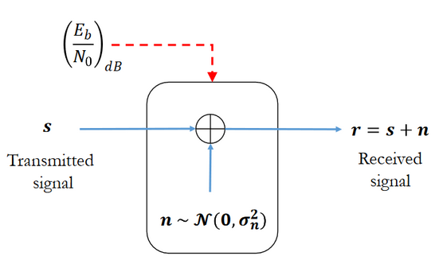
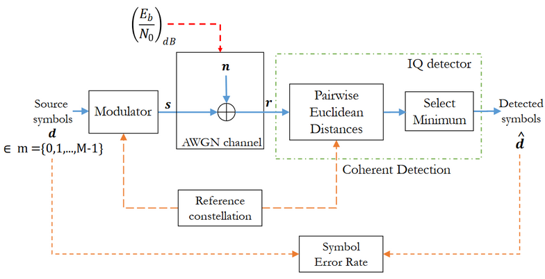
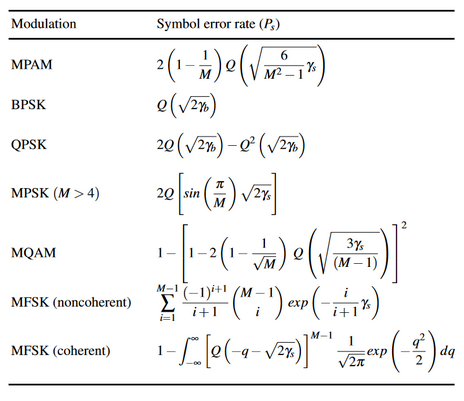
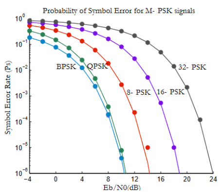
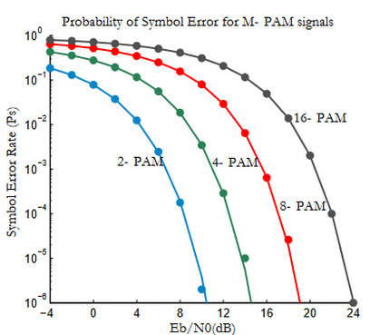

<!-- _class: lead -->

# Canais de Comunicação
Prof. Daniel Costa Araújo

---

## Definições

* Relação sinal ruído
  $$
    \gamma = \frac{P_r}{N_0B}
  $$

* Relação energia de símbolo de ruído
   $$
    \gamma _s = \frac{E_s}{N_0B} = k \frac{E_b}{N_0B} = \log_2(M) \gamma _b 
   $$

   * $\gamma _s$ é a SNR por símbolo
   * $\gamma _b$ é a SNR por bit

---

## Modelo de Canal AWGN

---

## Framework de avaliação

--- 
## Desempenho das Modulações em Canais AWGN

---
## Comparativo entre modulações

---
## Canais com desvanecimento: Representação Física

---
## Canais com desvanecimento
* Características
  * Distorção em fase e frequência
  * Interferência intersimbólica
  * Canais variantes e invariantes no tempo